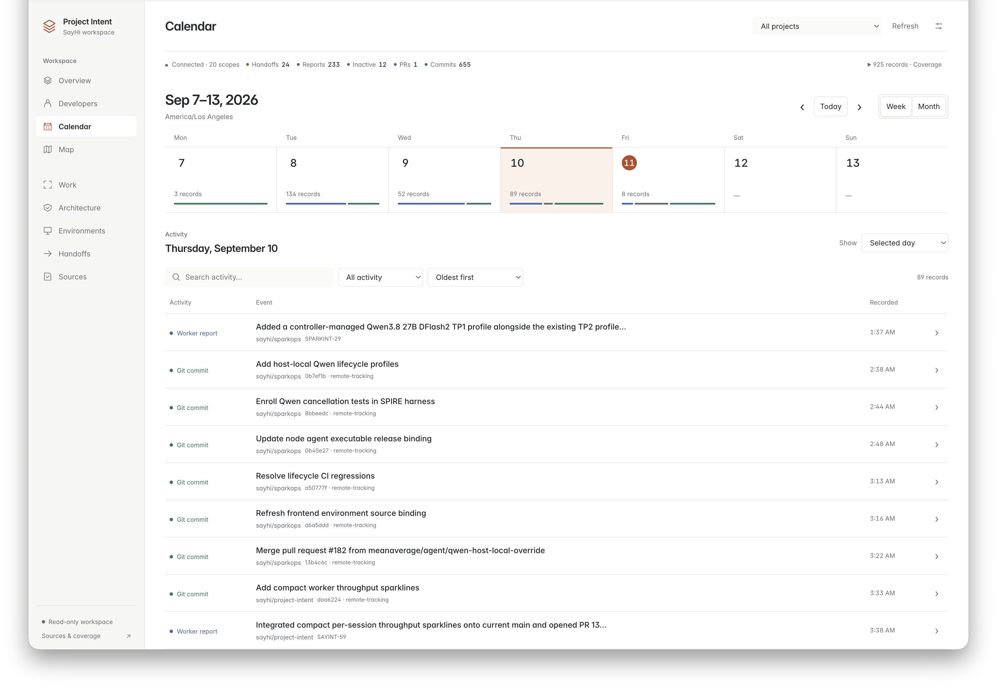
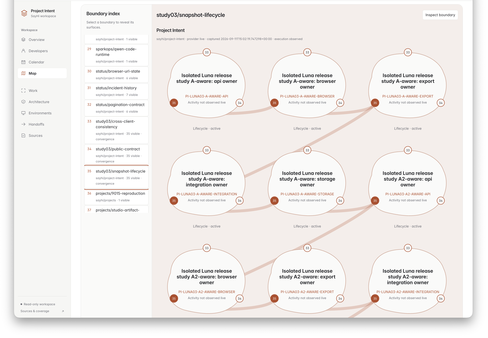

# BEVELA (PI-Project-Intent)

*Do not take BEVELA™ if you are allergic to concurrent agents.*


## $1,250.00? For a cup of tea?

One coding agent changed prices from dollars to integer cents. Another kept building receipts as if nothing had changed.

Both pieces of code looked reasonable. The checkout total was even correct.

The receipt?

```text
tea:   $1250.00
cake:   $725.00
```

Welcome to concurrent software development with AI agents.

**Project Intent gives coding workers shared project state so independently reasonable changes can still become one coherent product.**

Workers can see neighboring intent, declared architectural seams, active work and integration context—across repositories, worktrees and component boundaries—before `$12.50` becomes `$1,250.00`.

[Results](RESULTS.md) · [How it works](#how-it-works) · [Get started](#get-started) · [Architecture](docs/ARCHITECTURE.md)

---

## We tried giving the problem a smarter model.

It still lost.

On the original seven-seam migration, **Luna Low with Project Intent preserved every seam in both runs.** Neither Luna Low nor the stronger Sol Low configuration completed the whole project without PI.

```text
SEVEN SEAMS / LOW-EFFORT A/B/C
============================

A   LUNA LOW / WITHOUT PI
    Run 1   [.......]   0/7
    Run 2   [##.....]   2/7

B   SOL LOW / WITHOUT PI
    Run 1   [###....]   3/7
    Run 2   [####...]   4/7
    Run 3   [###....]   3/7

C   LUNA LOW / WITH PI
    Run 1   [#######]   7/7
    Run 2   [#######]   7/7

# preserved seam   . failed seam
```

**Two complete projects with PI. None across five ordinary runs.**

Small exploratory batches, every run shown, low reasoning effort throughout. This does not prove PI makes weaker models smarter. It suggests something more interesting:

> **Sometimes the model is not the problem. The project state is.**

[Explore the A/B/C discovery →](docs/results/seven-seams.md#low-effort-abc-comparison)

---

## The problem lives between the changes

The tea bug is deliberately tiny because the failure mode is not.

A worker changes a schema. Another keeps using the old one. One migrates a security boundary. Another still assumes the previous authorization model. A producer and consumer can each pass their own tests while the combined product is wrong.

Project Intent began inside sayhi.io studio: one product assembled from many independently developed repositories, with AI workers changing APIs, schemas, runtime assumptions and security boundaries at the same time.

Git records what changed. **Project Intent records what workers say they are changing next, what boundaries they share, and what still has to work together.**

That is the gap PI is trying to close.

## How it works

**Keep the workers' normal tools. Give them shared project context.**

1. **Find the actual task.** Inspect its scoped requirements, constraints, acceptance criteria and related architecture.
2. **Declare the work.** Enroll the session with its checkout, paths, seams and intended changes.
3. **Reconcile the boundary.** Refresh peer context and inspect the affected code. For competing repairs, agree on one repairer and a bounded set of paths.
4. **Verify the combined result.** Check both sides of the contract, retain useful evidence and hand off unresolved impacts.

Workers get **related task requirements**, **last-known peer summaries** and **explicit repair agreement**.
A shared seam is context—not a lock, a scheduler or permission to take over someone else's work.

[Worker workflow](skills/project-intent/SKILL.md) · [Repair agreement](docs/REPAIR_COORDINATION.md) · [Reporting & handoff](docs/REPORTING.md)

## A correctness win is not yet a concurrency win

The A/B/C result was exciting. Then we tried to figure out what it actually meant.

Was PI helping because workers had better peer context? Was it enabling useful parallel work? Was it merely rescuing a weaker model? Or were we testing the wrong thing entirely?

So we kept running experiments—and kept the inconvenient results.

### Great teamwork. Still slower than one worker.

With a predefined producer/consumer split, both PI workers landed distinct, retained contributions during overlap in **3/3 projects**, versus **0/3 ordinary projects**.

That is the behavior we wanted to see.

The economics were less flattering: **every condition still passed 7/7**, and one ordinary worker had the lowest median completion time and token usage on this small fixture. PI made the concurrent work cleaner, but the task was too short for parallelism to repay its coordination overhead.

[Split-role study →](docs/results/concurrency.md)

### Three agents walk into a repository. One does all the work.

Next we gave three Luna Medium workers the **same complete objective** and removed the predefined split.

PI told them about one another. They still did not meaningfully divide the implementation.

One worker implemented the entire migration in every project; the others mostly attempted duplicate work. Ordinary and PI projects all reached 7/7, and PI added overhead.

That does not necessarily mean PI failed. It may mean **task decomposition belongs to an orchestrator, while PI should stay focused on keeping already-divided work coherent.**

[Self-organizing study →](docs/results/self-organizing.md)

### The harder refund fixture moved the needle again

On a more difficult overlapping-edit migration, Luna Medium ordinary workers scored **0/7, 6/7, 6/7**. Luna Medium + PI scored **0/7, 7/7, 7/7**.

That is promising, but not clean enough to declare victory. One PI run failed completely, Luna High solved the task once without PI, and the treatment still bundles shared context with coordination behavior.

So the next methodological shift is deliberate: **stop making the model weaker to make PI visible. Make the project harder while keeping the worker capable enough to use PI reliably.**

[Refund torture study →](docs/results/refunds.md)

### Yeah, yeah. You only use Codex Astra XHigh.

Fair objection.

A benchmark can make PI look useful simply by choosing a worker that is weak enough to lose track of a concurrent project. But that creates a nasty confound: the same weaker worker may also be worse at following PI's own coordination instructions.

So we are changing the test, not weakening the model.

Our working hypothesis is that the cleanest evaluation regime looks like this:

- use a **strong worker whose PI protocol compliance is already reliable**;
- make the **distributed software problem** difficult enough that concurrent ordinary workers do not succeed every time;
- keep the programming task within that model's actual capability;
- make the difficulty come from changing schemas, stale assumptions, cross-repository contracts, migration/versioning, retries, compatibility and integration—not puzzle tricks;
- freeze the task decomposition so PI is tested as a coordination substrate, not as an accidental orchestrator.

In other words, if Sol Medium can follow PI correctly but also solves the fixture 10/10 without it, **the fixture is too easy**. The answer is not to drop to a dumber model until something breaks. The answer is to build a harder project.

We built and calibrated two four-component candidates with Sol Medium. It first passed **8/9 PI protocol scenarios**, with one reporting/release timeout and transcription friction—not perfect compliance.

Then ordinary concurrent workers passed **3/3 projects on each candidate**, retaining four distinct component implementations per project. Even the second candidate's producer-designed payloads and durable partial returns did not create observed correctness headroom.

**The bounded study stopped before the single-worker ceiling or matched PI comparison. No PI effect was measured.** Normal source inspection still handled these seams; a future version must test genuinely unresolved cross-component assumptions without weakening the worker or crippling ordinary tools.

[Distributed calibration results →](docs/results/sol-distributed.md) · [Protocol calibration →](docs/results/sol-protocol.md)

### Then we tried native Qwen Code—and steering.

With steering, Qwen3.8 DFlash2 completed **ten fresh seven-seam projects at 7/7**.
On the harder distributed candidate, a later 500-limit run reached **15/15**.
Those successes belong alongside the failures—not in place of them. The September
9–10 studies used different worker arrangements and settings, not one pooled benchmark:

- [Distributed candidate 2 · thinking on](docs/results/qwen-distributed.md): **0/5 accepted in each arm**; 35/40 workers timed out across both arms.
- [Original seven seams · Medium](docs/results/qwen-seven-seams.md): **3/3 ordinary versus 2/3 PI** projects accepted.
- [First seven-seam steering pilot · thinking off](docs/results/qwen-steering.md): **1/1 accepted, 7/7 in 95s**; no new matched control and only one pilot.
- [Ten steering-on repeats · thinking off](RESULTS.md#qwen-steering-ten-repeat-cohort): **10/10 accepted, every project 7/7**, versus the [earlier ordinary thinking-off baseline](docs/results/qwen-ordinary-thinking-off.md): **0/1 accepted, 0/7**. Same fixture, task prompts, checker, runtime and model; two workers per project. PI median **99.4s**. The baseline is one run, not ten matched control repeats.
- [Distributed 500-limit follow-ups · thinking off](RESULTS.md#qwen-distributed-500-limit-follow-ups): **8/15 → 14/15 → 15/15** across three fresh projects. The final artifact passed in **13m 15s**, but one worker exited nonzero, so clean autonomous completion was not established.
- [Latest independent requests · September 10](docs/results/qwen-independent-requests.md): **3/3 ordinary versus 1/3 PI+steering** accepted; ordinary scored 15/15 each, PI scored 13/15, 13/15, 15/15.

The latest comparison is the study owner's recorded outcome summary, not a newly audited
per-worker measurements export. Two PI projects stopped at the 30-minute boundary;
that does not establish that PI caused their failures. This later three-worker
comparison already used 500 tool calls per turn and 500 session turns. Those were
native execution limits, not notification counts; the steering allowance remained
12 notices per worker. The earlier successes and later comparison do not by
themselves establish a causal PI advantage.

On the smaller seven-seam fixture, [one ordinary worker with thinking off](docs/results/qwen-single-worker.md)
also passed **3/3**, with a median **47.9 seconds**. Notifications reaching workers
are not the same as workers agreeing on a repair or producing a correct integration.
The [steering follow-up remains on hold](docs/QWEN_STEERING_BACKLOG.md); it is not a shipped PI backend feature.

[All Qwen runs and diagnostics](RESULTS.md#study-history--newest-first) include
confidence prompts, compact instructions, failures and timing limitations.
The Qwen harnesses and offline regression tests are under `experiments/` and `tests/`;
running the test suite does not rerun these model studies. See the
[publication and verification notes](docs/results/qwen-publication.md).

> **Do not make the worker less capable to make Project Intent look useful. Make the coordination problem harder while keeping the worker capable.**

That is the standard we want the next round of results to meet.

**Correctness. Project time. Worker effort. Useful concurrency.** We measure them separately.
More tokens are not automatically worse; more active processes are not automatically progress.

[All results, newest first →](RESULTS.md) — including failures, interrupted attempts, backend versions and follow-up questions.

---

## One product. A dozen-ish repositories. What could go wrong?

Project Intent started because sayhi.io studio is one product assembled from nearly a dozen repositories.

Once AI workers started changing several of them concurrently, the human operator became the world's least interesting message bus: constantly relaying what one worker was doing to another worker somewhere else.

PI is an attempt to replace that human relay with durable shared project state.

The same coordination problem appears at several scales:

- different repositories sharing an API or product contract,
- different worktrees changing related behavior,
- several workers sharing one checkout,
- a worker handing work to a successor after its session ends.

PI does not require those workers to become nodes in a proprietary agent graph. They remain ordinary coding workers. PI is the shared substrate around them.

## Mission Control, without the commanding

**Mission Control is a read-only observatory—not a control panel for its workers.**

Browse workstreams, architecture, reports, worker/session observations and attention indicators. The [Developers Board and work calendar](docs/ACTIVITY_VIEWS.md) separate current observations from timestamped evidence; the experimental [Workstream Map](docs/WORKSTREAM_MAP_EXPERIMENT.md) shows declared boundaries and convergence pressure.

Historical registrations are not a headcount. Missing observations do not mean no one is working. Integration context and repair plans are CLI features; Mission Control does not yet display those plans.

<p align="center">
  <a href="docs/images/mission-control-calendar.png">
    
  </a>
</p>

**Calendar.** A compact week above searchable, filterable evidence: reports, handoffs
and scoped Git observations. Select either image to inspect it at full resolution.

<p align="center">
  <a href="docs/images/mission-control-map.png">
    
  </a>
</p>

**Workstream Map.** Inspect declared shared boundaries across workstreams.
These September 11 UI snapshots illustrate the read-only views; lifecycle labels
are not proof of live activity, and connections are not verified conflicts or test results.

## Get started

Python **3.11+**. No runtime dependencies outside the standard library.

From this repository:

```bash
python3 -m venv .venv
.venv/bin/python -m pip install -e .
.venv/bin/python -m unittest discover -s tests -v
source .venv/bin/activate
```

With your [local worker scope map configured](docs/OPERATIONS.md), move to the **actual task checkout**:

```bash
cd /absolute/path/to/your/task-checkout
project-intent onboard --query "task keywords"
project-intent onboard --scope YOUR_SCOPE --workstream SELECTED_WORKSTREAM
```

Review the assignment, then follow the returned enrollment template. Installation alone does not discover arbitrary provider projects. A missing task can be recorded through a separately configured, authorized [registration capability](docs/TASK_REGISTRATION.md).

<details>
<summary><strong>Run Mission Control locally</strong></summary>

With the environment above active and your private service configuration prepared:

```bash
project-intent serve --config /private/project-intent/config.json --port 8290
```

Open `http://127.0.0.1:8290`. Keep it loopback-only unless a separately reviewed network, TLS and identity boundary is in place. Provider credentials stay outside the browser and repository.

See [Operations](docs/OPERATIONS.md) for configuration, recovery and deployment boundaries.

</details>

## What PI does not magically solve

**It is not your orchestrator.** PI currently does not decide who should work on what. That may belong to a separate orchestrator agent.

**It does not read minds.** PI is declaration-based. Hidden edits remain hidden until a worker reports or discovers them.

**It does not grant authority.** A lease, repair claim or “done” report is neither editing permission nor proof of correctness.

**It does not make bad code good.** The integrated project still has to pass its actual tests and acceptance checks.

**It is not distributed locking.** Current repair agreement is cooperative and scoped; there is no filesystem fencing or global seam lock.

**It is not deployment.** Review, CI, merge and activation remain separate concerns.

Those are intentional boundaries, not hidden footnotes.

## Go deeper

- **Evaluate:** [Results](RESULTS.md) · [Methodology](docs/CLI_AB_EVALUATION.md) · [Original seven seams](docs/CLI_SEVEN_SEAMS.md) · [Refund torture](docs/CLI_TORTURE_REFUNDS.md)
- **Understand:** [Architecture](docs/ARCHITECTURE.md) · [Read model](docs/READ_MODEL.md) · [Worker skill](skills/project-intent/SKILL.md)
- **Operate:** [Operations](docs/OPERATIONS.md) · [Integration gate](docs/INTEGRATION_GATE.md) · [Session connector](docs/SESSION_CONNECTOR.md)

---

*Independent workers. One coherent product. And, ideally, reasonably priced tea.*
